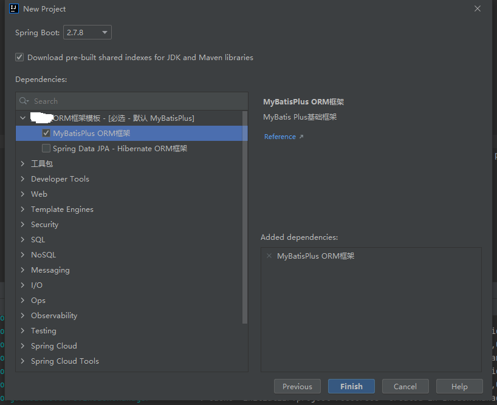

# spring-initializr

### spring-initializr 配置文档
```text 
##原 initializr 地址
https://start.spring.io/
```
#### 1、放置配置文件和代码
* 如代码框架是mybatis，放置在当前目录下
``templates/mybatis``
中，代码放置在``templates/mybatis/code``下，配置文件放置在``templates/mybatis/config``下。
* 如代码框架是hibernate，放置在当前目录下
  ``templates/hibernate``
  中，代码放置在``templates/hibernate/code``下，配置文件放置在``templates/hibernate/config``下。
#### 2、动态参数替换
全局采用#【关键字】替换对应配置，如``#【name】``，代表提取项目名
* ``#【name】``：提取项目名
* ``#【packageName】``：提取完整包名：如com.fpcloud.demo
* ``#【applicationName】``：提取完整项目名：如DemoApplication
* ``#【groupId】``：提取分组id：如com.fpcloud
* ``#【artifactId】``：提取组中模块的id：如demo
* ``#【version】``：提取版本号：如1.0.0
* ``#【description】``：提取项目详情：如Demo project for Spring Boot

#### 3、使用
##### 3.1 打开IDEA 创建项目
```text
File->New->Project
```
选择 
```text
Spring Initializr
```
将Server URL修改为服务地址：
```text
http://127.0.0.1:18080
```
##### 3.2 根据自己的项目修改对应参数

##### 3.3 选择对应ORM框架和其它工具类 - 默认生成MybatisPlus

